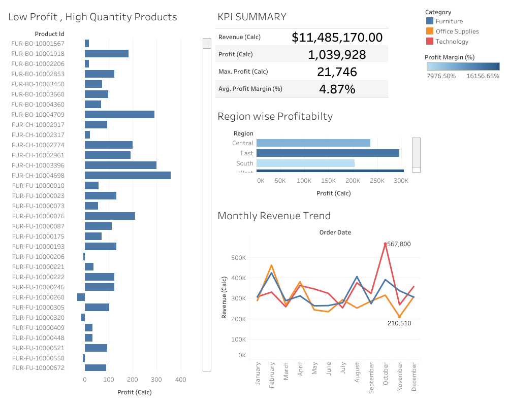

<!-- ===================== ARCHIVED NOTICE ===================== -->

# ⚠️ ARCHIVED REPOSITORY

> **Status:** Archived · No longer actively maintained

This repository has been **archived** and is no longer actively maintained.

The work originally contained here has been **migrated, refactored, and consolidated** into a single unified **Data Analyst Internship** repository.

All future updates, improvements, and documentation for this project are maintained **only in the central internship repository**.

---

### Redirect to Active Project

[](https://github.com/atharmshaikh/data-analyst-internship-tasks/tree/main/Capstone_Retail_Performance_Analysis)

**Active, maintained version:**  
https://github.com/atharmshaikh/data-analyst-internship-tasks/tree/main/Capstone_Retail_Performance_Analysis

---

## Why This Repository Was Archived

- This repository represented an **early, standalone submission**
- The project was later **rebuilt from scratch** with improved structure
- Documentation, analysis flow, dashboards, and insights were **refined**
- Version control and repository organization were **standardized**
- Maintaining multiple sources was avoided to preserve a **single source of truth**

---

## Historical Reference

This archived repository is preserved **strictly for historical reference**.  
No further changes, fixes, or enhancements will be made.

<!-- =========================================================== -->

# 🛍️ Retail Business Performance & Profitability Analysis

## 📌 Objective
Analyze historical retail transaction data to:
- Identify **profit-draining product categories**
- Optimize **inventory turnover and pricing strategies**
- Discover **seasonal revenue trends**
- Support data-driven business decisions through a comprehensive dashboard

---

## 🛠 Tools & Technologies Used

| Tool                     | Purpose                                                  |
|--------------------------|----------------------------------------------------------|
| **SQLite (DB Browser)**  | Data import, cleaning, and SQL-based analytics           |
| **Python (Pandas)**      | Data correlation and preprocessing                       |
| **Tableau Cloud**        | Dashboard development and KPI visualization              |
| **GitHub**               | Project versioning and repository management             |

---

## 📦 Dataset Overview
The dataset is a transactional log of retail orders, containing:
- Product pricing (cost & list price)
- Discount percentages and quantities
- Date-wise order history
- Product categories, customer segments, and regional info

🗃 **Original CSV** → Cleaned using SQL queries → Exported as `retail_data.csv`

---

## 🧹 Data Cleaning & Calculations (SQL)

We imported the dataset into **DB Browser for SQLite**, then removed nulls and created derived fields for analytical KPIs.

### 🔢 Key Calculated Fields
- `Revenue` = `Quantity * List Price`
- `Discount Amount` = `(List Price * Discount % / 100) * Quantity`
- `Selling Price` = `Revenue - Discount`
- `Cost Total` = `Quantity * Cost Price`
- `Profit` = `Selling Price - Cost Total`
- `Profit Margin` = `Profit / Revenue`

---

## 🧮 SQL Query Highlights (📄 [`queries.sql`](./retail-orders-analysis.sql))

```sql
-- 1. View Cleaned Data
SELECT * FROM cleaned_orders;

-- 2. Top 10 Revenue Generating Products
SELECT product_id, SUM(actual_price) AS revenue
FROM cleaned_orders
GROUP BY product_id
ORDER BY revenue DESC
LIMIT 10;

-- 3. Top 5 Products by Region
WITH cte AS (
  SELECT region, product_id, SUM(actual_price) AS revenue
  FROM cleaned_orders
  GROUP BY region, product_id
)
SELECT * FROM (
  SELECT *, ROW_NUMBER() OVER (PARTITION BY region ORDER BY revenue DESC) AS rn
  FROM cte
) a WHERE rn <= 5;

-- 4. Monthly Sales by Year
WITH cte AS (
  SELECT YEAR(order_date) AS order_year, MONTH(order_date) AS order_month, SUM(actual_price) AS sales
  FROM cleaned_orders
  GROUP BY order_year, order_month
)
SELECT order_month,
  SUM(CASE WHEN order_year = 2022 THEN sales ELSE 0 END) AS sales_22,
  SUM(CASE WHEN order_year = 2023 THEN sales ELSE 0 END) AS sales_23
FROM cte
GROUP BY order_month
ORDER BY order_month;

-- 5. Highest Revenue Category (Monthly)
WITH cte AS (
  SELECT category, DATE_FORMAT(order_date, "%Y/%M") AS year_month, SUM(actual_price) AS revenue
  FROM cleaned_orders
  GROUP BY category, year_month
)
SELECT * FROM (
  SELECT *, ROW_NUMBER() OVER (PARTITION BY category ORDER BY revenue DESC) AS rn
  FROM cte
) a WHERE rn = 1;

-- 6. Sub-Category Revenue Growth Comparison
WITH cte AS (
  SELECT sub_category, YEAR(order_date) AS order_year, SUM(actual_price) AS sales
  FROM cleaned_orders
  GROUP BY order_year, sub_category
),
cte2 AS (
  SELECT sub_category,
    SUM(CASE WHEN order_year = 2022 THEN sales ELSE 0 END) AS sales_22,
    SUM(CASE WHEN order_year = 2023 THEN sales ELSE 0 END) AS sales_23
  FROM cte
  GROUP BY sub_category
)
SELECT *, 
  (sales_23 - sales_22) * 100.0 / sales_22 AS growth
FROM cte2
ORDER BY growth DESC;
````

---

## 📊 Tableau Dashboard (Cloud)

### ✅ Dashboard Features:

| Sheet                         | Description                                   |
| ----------------------------- | --------------------------------------------- |
| **KPI Summary**               | Total Revenue, Profit, Max Profit, Avg Margin |
| **Low Profit, High Quantity** | Products with high sales but low returns      |
| **Region-wise Profitability** | Profit distribution across regions            |
| **Monthly Revenue Trend**     | Line chart showing seasonality of orders      |

📸 **Screenshot:**



---

## 📌 Insights & Strategic Suggestions

| Insight                                 | Actionable Recommendation                          |
| --------------------------------------- | -------------------------------------------------- |
| Low Profit Margin despite high quantity | Review pricing, reduce discounts                   |
| East Region shows highest profitability | Consider expansion or investment in this region    |
| October and February see revenue peaks  | Align marketing and stock strategy to peak seasons |
| Some sub-categories declined in 2023    | Consider discontinuation or bundling strategy      |

---

## 📁 Project Structure

```plaintext
Retail-Performance-Analysis/
├── cleaned_orders.csv
├── queries.sql
├── Dashboard.twbx
├── screenshots/
│   └── Dashboard.png
├── README.md
└── report.pdf
```
